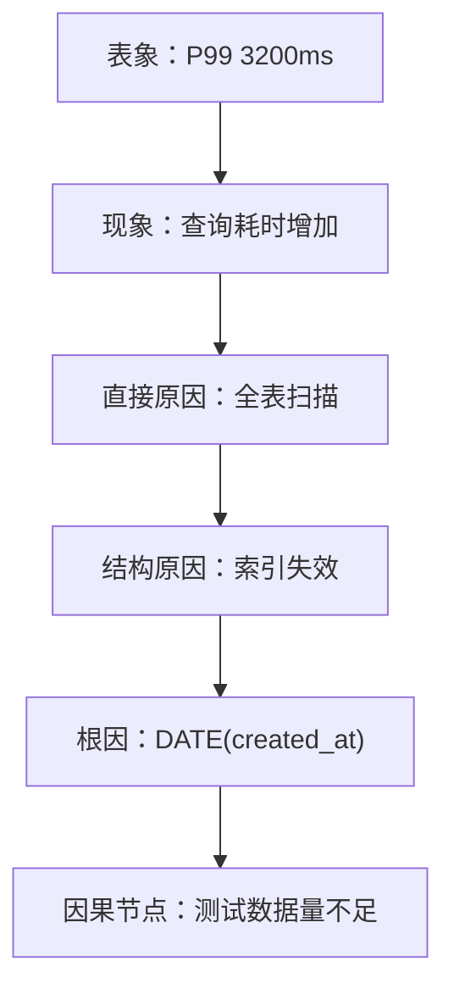
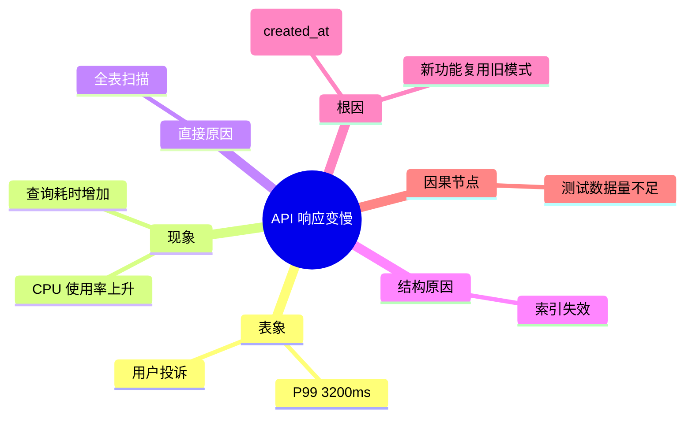

# Problem Tree 文件呈现指南

> Problem Tree 是层级结构。Markdown 无序列表是最简单的方式，但不是唯一的方式。

---

## 推荐格式 1：Markdown 嵌套列表（最简单）

```markdown
# Problem: API 响应变慢

## Problem Tree

- 表象：/api/v1/orders P99 从 120ms → 3200ms
  - 现象：数据库查询耗时增加
    - 直接原因：订单表走了全表扫描
      - 结构原因：DATE(created_at) 导致索引失效
        - 根因：新功能复用了旧查询模式
          - 因果节点：测试环境数据量小，未触发生产级问题
```

**优点**：任何编辑器都能打开，版本控制友好。

**缺点**：层级深了以后缩进太多，视觉上不够直观。

---

## 推荐格式 2：Mermaid 流程图（最直观）

GitHub / GitLab 原生支持渲染。

```markdown

```

**优点**：视觉上直观，层级关系一目了然。

**缺点**：需要渲染器支持；复杂树可能布局混乱。

---

## 推荐格式 3：Mermaid 思维导图（适合发散）

```markdown

```

**优点**：适合发散思考，不强制线性关系。

**缺点**：不适合表达严格的因果关系。

---

## 推荐格式 4：折叠列表（适合长树）

用 HTML `<details>` 标签实现折叠，保持文档整洁。

```markdown
## Problem Tree

<details>
<summary>表象：P99 3200ms</summary>

- 现象：查询耗时增加
  - 直接原因：全表扫描
    - 结构原因：索引失效
      - 根因：DATE(created_at)
        - 因果节点：测试数据量不足

</details>
```

**优点**：长树可以折叠，文档保持整洁。

**缺点**：需要点击展开，不适合打印/PDF。

---

## 推荐格式 5：表格（适合浅层树）

| 层级 | 节点 | 说明 |
|------|------|------|
| 表象 | P99 3200ms | 用户可感知 |
| 现象 | 查询耗时增加 | 监控可观测 |
| 直接原因 | 全表扫描 | 技术诊断 |
| 结构原因 | 索引失效 | 设计层面 |
| 根因 | DATE(created_at) | 代码层面 |
| 因果节点 | 测试数据量不足 | 可永久解决 |

**优点**：紧凑，适合对比多棵树的结构。

**缺点**：不适合深层树（>3 层）。

---

## 选择建议

| 场景 | 推荐格式 |
|------|---------|
| 快速记录 | 嵌套列表 |
| 团队分享 / README | Mermaid 流程图 |
| 发散思考 | Mermaid 思维导图 |
| 长文档 / 归档 | 折叠列表 |
| 对比分析 / 汇报 | 表格 |

---

## 最佳实践

1. **一棵 Problem Tree 对应一个 `problem.md`**
2. **根节点必须是可验证的现象**，不是猜测
3. **叶子节点必须是因果节点** — 找到它就可以永久解决问题
4. **如果树太深（>5 层），考虑横向拆分** — 可能是多个问题混在一起
5. **Agent 读取时优先解析嵌套列表** — 结构化最强，语义最清晰
