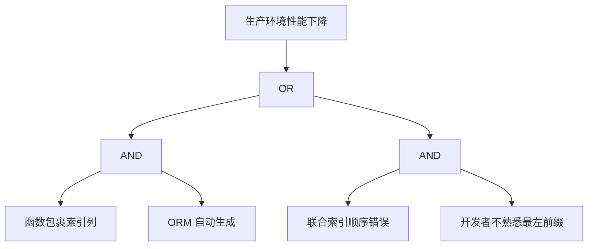

# Risk Tree 文件呈现指南

> Risk Tree 不是线性结构，而是网状结构。需要能表达"多因一果"和"多果一因"。

---

## 推荐格式 1：Markdown 嵌套列表（最简单）

适合表达层级风险，但不适合表达交叉关系。

```markdown
# Risk: 查询模式导致索引失效

## Risk Tree

- 根风险：生产环境性能下降
  - 失效模式 1：函数包裹索引列
    - 触发条件：ORM 自动生成 DATE(column) 查询
    - 影响：全表扫描 → P99 飙升
    - 缓解：Prevent（CR 检查清单）+ Detect（CI EXPLAIN）
  - 失效模式 2：联合索引顺序错误
    - 触发条件：开发者不熟悉最左前缀原则
    - 影响：索引部分失效
    - 缓解：Prevent（SQL Review）+ Detect（慢查询告警）
```

---

## 推荐格式 2：Mermaid 故障树（最专业）

故障树分析（FTA）的标准表示法，用逻辑门表达关系。

```markdown

```

**优点**：专业，适合工程团队。

**缺点**：Mermaid 对逻辑门的支持有限，复杂树需要专用工具。

---

## 推荐格式 3：FMEA 表格（最实用）

风险树本质上是一组 FMEA 分析的集合。

```markdown
| 失效模式 | 触发条件 | S | P | U | RPN | Prevent | Detect | Recover |
|---------|---------|---|---|---|-----|---------|--------|---------|
| 函数包裹索引列 | ORM 自动生成 | 8 | 6 | 4 | 192 | CR 检查清单 | CI EXPLAIN | 查询熔断 |
| 联合索引顺序错误 | 开发者不熟悉 | 6 | 5 | 5 | 150 | SQL Review | 慢查询告警 | 紧急加索引 |
| 连接池耗尽 | 突发流量 | 9 | 6 | 4 | 216 | 熔断器 | 连接数监控 | 自动扩容 |
```

**优点**：
- 结构化最强，适合排序和筛选
- 可以直接计算 RPN
- Agent 最容易解析

**缺点**：不适合表达层级关系。

---

## 推荐格式 4：Markdown + Mermaid 混合（推荐）

**顶层用 FMEA 表格**，**每个失效模式用 Mermaid 展开细节**。

```markdown
# Risk: 查询模式导致索引失效

## FMEA 概览

| 失效模式 | S | P | U | RPN | 状态 |
|---------|---|---|---|-----|------|
| 函数包裹索引列 | 8 | 6 | 4 | **192** | 缓解中 |
| 联合索引顺序错误 | 6 | 5 | 5 | 150 | 观察中 |

## 失效模式 1：函数包裹索引列

```mermaid
graph LR
    A[ORM 生成查询] --> B[DATE(column)]
    B --> C[索引失效]
    C --> D[全表扫描]
    D --> E[P99 飙升]
```

- **Prevent**: CR 检查清单增加"索引列函数包裹"项
- **Detect**: CI 自动跑 EXPLAIN，标记全表扫描
- **Recover**: 查询级别熔断，超时自动降级

## 历史触发记录

- 2026-10-01: /api/v1/orders 接口，影响 2 小时，触发查询 `WHERE DATE(created_at) = ?`
```

**优点**：兼顾概览和细节，适合归档和共享。

---

## 选择建议

| 场景 | 推荐格式 |
|------|---------|
| 快速风险评估 | FMEA 表格 |
| 团队评审 / 汇报 | Mermaid 故障树 |
| 完整归档 | Markdown + Mermaid 混合 |
| Agent 自动分析 | FMEA 表格（结构化最强） |

---

## 最佳实践

1. **Risk Tree 不是一次性的** — 每次问题解决后都要更新
2. **失效模式必须可观测** — 每个风险都要有对应的 Detect 手段
3. **RPN > 150 必须缓解** — 这是行动阈值
4. **历史触发记录必须保留** — 这是组织学习的数据来源
5. **定期复审** — 每次迭代回顾时检查是否有新的风险模式
