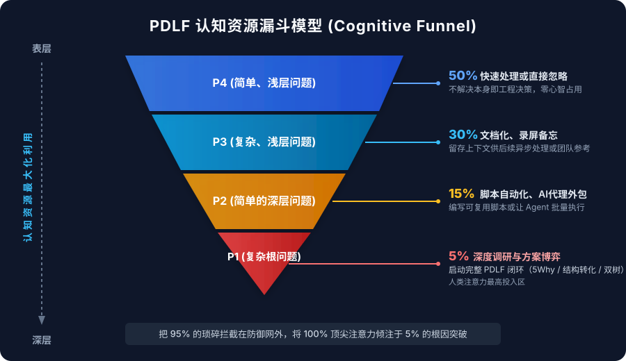

# 认知资源漏斗模型 (Cognitive Funnel)

> **"注意力不是无限的预算，而是极其稀缺的单兵武器。"**
> 漏斗模型是 PDLF 在 **Triage（初筛分流）** 阶段的认知防火墙：将 95% 的问题拦在重型分析之外，确保核心注意力 100% 聚焦于致命根因。

---

## 漏斗全景图



```
表层  ┌──────────────────────────────────────────────┐
  │  │ P4 (简单、浅层问题)           50% 快速处理/忽略 │
  │  ├──────────────────────────────────────────────┤
认 │  │ P3 (复杂、浅层问题)           30% 文档化/录屏   │
知 │  ├──────────────────────────────────────────────┤
资 │  │ P2 (简单的深层问题)         15% 脚本自动化/代理│
源 │  ├──────────────────────────────────────────────┤
最 │  │ P1 (复杂根问题)             5% 方案对比/深度5Why│
大 │  └──────────────────────────────────────────────┘
化 │                     ▼
深层                启动完整 PDLF 武器库
```

---

## 分层处理准则

| 层级 | 问题特征 | 发生占比 | 处理策略 | 人类认知开销 | 典型工具/角色 |
|------|---------|----------|----------|--------------|---------------|
| **P4** | 简单、浅层问题 | ~50% | **快速处理或直接忽略** | 0% ~ 5% | 单行 Fix / 忽略标记 |
| **P3** | 复杂、浅层问题 | ~30% | **文档化、录屏备忘** | ~10% | Issue 模板 / 录屏归档 |
| **P2** | 简单、深层问题 | ~15% | **脚本自动化、AI Agent/外包代理** | ~15% | CLI 脚本 / AI Coding Agent |
| **P1** | 复杂根问题 | ~5% | **多方案调研、5Why定位、结构转化** | **70% +** | 资深工程师 / 深度思考者 |

---

## 核心设计哲学

### 1. 认知防火墙 (Cognitive Firewall)
对于独立开发者和学生，最大的陷阱不是“代码跑得慢”，而是**“对 P4 的琐事大惊小怪，对 P1 的暗礁视而不见”**。漏斗的第一使命是**拒绝解决不值得解决的问题**。

### 2. 人机协同断点
- **P4 / P3 / P2**：是 AI Agent 和自动化脚本的主战场，人类只做路由分流。
- **P1**：才是人类大脑不可替代的战场。人类在 P1 负责定义真正的问题（Diagnose）与改写问题（Transform），再将解决与验证（Solve & Verify）交由 AI 辅助。

### 3. 与 PDLF 7阶段的联动
- **Discover** 捕获原始候选信号。
- **Triage** 立即导入漏斗模型分流：
  - 80%（P4/P3）在 Triage 阶段直接终结或降级处理，不进入后续阶段。
  - 15%（P2）走轻量自动化流。
  - 仅有 5%（P1）启动 Diagnose（5-Why、Problem Tree）与 Transform 闭环。
