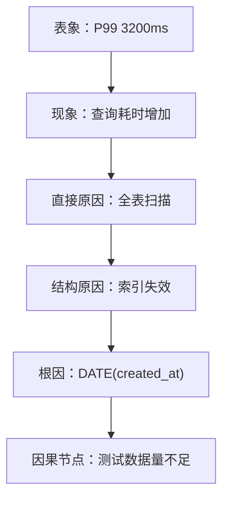

# Problem: API 响应突然变慢

> **问题 ID**: PDLF-2026-1001-001  
> **优先级**: P0  
> **复杂度**: 3/10  
> **状态**: ✅ 已解决  
> **关联**: [risk.md](risk.md) · [decisions.md](decisions.md)

---

## Discover

- **现象**: `/api/v1/orders` 接口 P99 延迟从 120ms 飙升到 3200ms
- **时间**: 2026-10-01 14:00
- **范围**: 所有用户，非特定地区
- **来源**: 生产监控告警


---

## Triage（初筛）

| 维度 | 评估 | 分数 |
|------|------|------|
| Impact | 核心交易链路，直接影响收入 | 高 |
| Urgency | 所有用户受影响，持续恶化 | 高 |
| Scope | 全平台 | 广 |
| Uncertainty | 已知症状，未知根因 | 中 |

**决策**: ✅ 值得立即处理

---

## Diagnose

### 5Why 因果链



1. **Why** 接口变慢? → 数据库查询耗时增加
2. **Why** 查询耗时增加? → 订单表走了全表扫描，没走索引
3. **Why** 没走索引? → 查询条件用了 `DATE(created_at)` 函数，导致索引失效
4. **Why** 会写出这种查询? → 新上线的报表功能需要按日期统计，开发直接复用了同一查询
5. **Why** 没发现? → 测试环境数据量小，没触发性能问题

**根因**: 新功能引入的查询模式在生产环境大数据量下导致索引失效

**停止检查**: ✅ 因果节点"测试数据量不足"可永久解决（注入生产级数据量到测试环境）

---

## Triage（Re-Triage）

- **定位后发现**: 这不是"某个接口慢"，而是"系统性查询模式问题"
- **影响评估升级**: 其他接口可能也存在类似隐患
- **决策**: 立即修复 + 全面排查同类问题

```
初筛评估: 单个接口问题 → P1
定位后评估: 系统性查询模式问题 → P0（升级）
```

---

## Transform

### 原始问题
"优化整个订单查询系统"

### 转化尝试

| 方案 | 转化模式 | 等价性 | 复杂度 | 风险 | 选择 |
|------|---------|--------|--------|------|------|
| 加函数索引 | 约束松弛 | 等价 | 5 | 高（DB变更） | ❌ |
| **改写查询** | **类比映射** | **等价** | **3** | **低** | **✅** |
| 加缓存层 | 降维 | 不等价 | 4 | 中 | ❌ |

**选择理由**: 改写查询 — 零风险、立即生效、不依赖 DB 变更、兼容所有环境。

### 验收标准
- EXPLAIN 确认走了 idx_created_at
- P99 < 200ms
- 无回归问题

---

## Solve

- **任务**: 改写 `WHERE DATE(created_at) = ?` → `WHERE created_at BETWEEN ? AND ?`
- **验收**: EXPLAIN 确认走了 idx_created_at，P99 < 200ms
- **状态**: ✅ 完成
- **部署时间**: 2026-10-01 15:20

---

## Verify/Challenge

| 维度 | 验证项 | 结果 |
|------|--------|------|
| 验证 | P99 恢复至 95ms | ✅ |
| 回归 | 所有 DATE(created_at) 查询，共 3 处，已修复 | ✅ |
| 攻击 | 数据量再涨 10 倍？ | 索引仍有效，已加监控 500ms |
| 边界 | 极端日期范围（跨月/跨年） | 测试通过 ✅ |

---

## Learn

### 问题模式
- **模式名称**: 函数包裹索引列导致索引失效
- **触发条件**: ORM 自动生成 DATE(column) 查询
- **早期信号**: 查询计划显示全表扫描

### 解决方案
- **方案**: 改写查询为范围查询
- **可复用场景**: 所有函数包裹索引列的查询
- **边界条件**: 时间范围查询替代函数查询

### 检测方法
- **Prevent**: CR 检查清单增加"索引列函数包裹"项
- **Detect**: CI 自动 EXPLAIN，标记全表扫描
- **Recover**: 查询熔断，超时降级

### 知识传播
- **分享对象**: 全团队
- **形式**: 技术分享 + 检查清单更新
- **规范更新**: 代码审查清单 v2.1

### 风险录入
- **已录入 risk.md**: ✅
- **RPN**: 192
- **监控状态**: 已部署慢查询告警

---

## 复盘：从 L0 → L3

```
L0 信号: "CPU 90%" / "P99 飙升" — 只是现象
    ↓
L1 候选: "查询慢导致超时" — 需要确认
    ↓
L2 关键: "索引失效导致全表扫描" — 可行动
    ↓
L3 风险: "函数包裹索引列 = 系统性模式" — 影响未来
```

**关键跃迁**: L1→L2 通过 Diagnose 找到根因；L2→L3 通过 Learn 提取模式。

**组织学习**: 此模式已录入 Risk Tree，下次同类问题可在 L1 阶段提前拦截。
