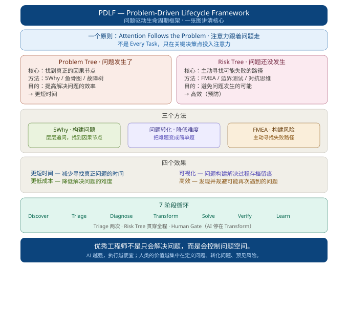

<p align="center">
  
</p>

<h1 align="center">PDLF — Problem-Driven Lifecycle Framework</h1>

<p align="center">
  <b>问题驱动生命周期框架</b><br>
  <i>优秀工程师不是只会解决问题，而是会控制问题空间。</i>
</p>

<p align="center">
  <a href="#快速开始">快速开始</a> ·
  <a href="#一个原则">一个原则</a> ·
  <a href="#两颗树">两颗树</a> ·
  <a href="#三个方法">三个方法</a> ·
  <a href="#四个效果">四个效果</a> ·
  <a href="#7阶段循环">7 阶段循环</a> ·
  <a href="#agent使用">Agent 使用</a>
</p>

---

## 一句话记住

> **Attention Follows the Problem.**
>
> 注意力跟着问题走，不是跟着 Task 走。

如果你经常遇到这些情况，这个框架就是为你写的：

> 多个项目轮着转，带着焦虑使用 AI 完成项目，却花费大量的时间在修 Bug 上；表面上效率很高，实则浪费了大量的注意力资源，Token 大量燃烧，却在花大钱办小事。明明想要修改的是这个问题，AI 却理解错了意思，越改越错，甚至声称改完了，实际上根本没有完成。同一个问题反复出现，每次都从零开始排查，解决后也不知道"下次怎么更早发现"。

**PDLF 不是教你更快解决问题，而是教你在问题的每个阶段做出正确决策。**

决策对了，执行自然高效；决策错了，执行越快浪费越大。

---

## 一张图看懂

```
┌────────────────────────────────────────────────────────────┐
│                    一个原则                                 │
│           Attention Follows the Problem                    │
│                    注意力跟着问题走                          │
├──────────────────────────┬─────────────────────────────────┤
│        Problem Tree       │           Risk Tree             │
│        问题发生了          │          问题还没发生            │
│  "真正的问题是什么？"       │    "还可能在哪里失败？"           │
│        效率提升           │        成本降低 + 预防            │
├──────────────────────────┴─────────────────────────────────┤
│                    三个方法                                 │
│   5Why(构建问题) · 问题转化(降低难度) · FMEA(构建风险)        │
├────────────────────────────────────────────────────────────┤
│                    四个效果                                 │
│   更短时间 + 更低成本 + 可视化 + 可复用                        │
└────────────────────────────────────────────────────────────┘
```

---

## 你属于哪类用户？

<details>
<summary><b>工程师 / 开发者</b> — 修 Bug、查故障、性能优化</summary>

**你的痛点**：
- 花了 3 小时修 Bug，最后发现修错了地方
- 同一个问题反复出现，每次都从零开始排查
- AI 给的方案看着对，执行完发现场景不匹配

**快速入口**：
```bash
# 一行命令创建技术问题
pdlf new "API响应变慢" --scene tech
```

**推荐阅读**：
- [检查清单: Triage](300-methods/checklist-templates/351-triage-checklist.md)
- [检查清单: Diagnose](300-methods/checklist-templates/353-diagnose-checklist.md)
- [示例: 调试慢查询](400-examples/410-debug-slow-api/)

</details>

<details>
<summary><b>项目经理 / Team Lead</b> — 项目风险评估、进度管理</summary>

**你的痛点**：
- 项目风险总是事后才发现
- 团队成员重复踩同样的坑
- 无法量化项目中的不确定性

**快速入口**：
```bash
pdlf new "Q4项目风险评估" --scene project
```

**推荐阅读**：
- [FMEA 指南](300-methods/320-fmea-guide.md)
- [检查清单: Verify](300-methods/checklist-templates/352-verify-checklist.md)

</details>

<details>
<summary><b>学生 / 自学者</b> — 考研、技能提升、焦虑管理</summary>

**你的痛点**：
- 带着焦虑学习，效率越来越低
- 被别人的进度绑架，没有自己的节奏
- 学了很多，但不知道怎么验证效果

**快速入口**：
```bash
pdlf new "考研复习进度滞后" --scene learning
```

**推荐阅读**：
- [示例: 考研规划](400-examples/420-kaoyan-planning/)
- [检查清单: Transform](300-methods/checklist-templates/354-transform-checklist.md)

</details>

<details>
<summary><b>AI 使用者 / Prompt 工程师</b> — 控制 AI 输出质量</summary>

**你的痛点**：
- AI 越改越错，甚至声称完成了实际没有
- Token 大量燃烧，却花大钱办小事
- 明明想修改 A，AI 却理解成了 B

**快速入口**：
```bash
pdlf new "AI输出不符合预期" --scene ai
```

**推荐阅读**：
- [Human Gate 规则](200-structure/210-lifecycle-7-stages.md)
- [检查清单: Transform](300-methods/checklist-templates/354-transform-checklist.md)

</details>

<details>
<summary><b>产品经理 / UX</b> — 需求分析、用户体验问题</summary>

**你的痛点**：
- 用户反馈了很多问题，但不知道真正该解决哪个
- 功能上线了，但不知道是否解决了用户痛点
- 竞品分析做了很多，但无法转化为行动

**快速入口**：
```bash
pdlf new "用户留存率下降分析" --scene product
```

**推荐阅读**：
- [检查清单: Triage](300-methods/checklist-templates/351-triage-checklist.md)
- [检查清单: Learn](300-methods/checklist-templates/355-learn-checklist.md)

</details>

---

## 快速开始

### 5 分钟上手

**第 1 步：创建问题目录**

```bash
mkdir my-problem && cd my-problem
touch problem.md
```

**第 2 步：复制模板**

```markdown
# Problem: [一句话描述问题]

> **问题 ID**: PDLF-YYYYMMDD-001
> **优先级**: P{0-3}
> **复杂度**: {1-10}/10

## Discover
- 现象: [可观测的事实]
- 时间: [YYYY-MM-DD HH:MM]
- 来源: [监控/用户反馈/测试]

## Triage
| 维度 | 评估 | 分数 |
| Impact | [高/中/低] | [1-10] |
| Urgency | [高/中/低] | [1-10] |
| Scope | [广/中/窄] | [1-10] |
| Uncertainty | [高/中/低] | [1-10] |
决策: [立即处理/计划处理/接受风险]

## Diagnose
1. Why [现象]? → [原因]
2. Why [原因]? → [原因]
3. Why [原因]? → [原因]
**根因**: [一句话]

## Transform
- 原始: [问题描述]
- 尝试1: [方案] → [评估]
- 尝试2: [方案] → [评估]
- 选择: [方案]
- 复杂度: {X}/10

## Solve
- 任务: [具体行动]
- 验收: [可验证的标准]
- 状态: [待开始/进行中/已完成]

## Verify
- [ ] 原始症状消失
- [ ] 回归测试通过
- [ ] 边界测试通过
- [ ] 无新风险引入

## Learn
- 教训: [一句话]
- 预防: [具体措施]
- 风险模式: [是否录入 risk.md]
```

**第 3 步：按 7 阶段填写，每完成一个打勾**

- [ ] Discover — 记录现象
- [ ] Triage — 判断是否值得处理
- [ ] Diagnose — 5Why 找到根因
- [ ] Transform — 选择最优方案
- [ ] Solve — 执行（交给 AI）
- [ ] Verify — 验证 + 攻击解空间
- [ ] Learn — 沉淀，下次更早发现

---

## 一个原则

**Attention Follows the Problem.**

人的注意力不应该平均分配给每一个任务，而应该跟随问题、风险和关键判断节点移动。

```
传统做法：每个 Task 都投入注意力
PDLF 做法：只在关键决策点投入注意力

  Discover ──→ Triage ──→ Diagnose ──→ Transform ──→ Solve ──→ Verify ──→ Learn
     ↑                                                                            ↓
     └──────────────── 循环扩大"提前发现"能力 ─────────────────────────────────────┘
```

[详细 → `100-principles/110-attention-follows-problem.md`](100-principles/110-attention-follows-problem.md)

---

## 两颗树

| | **Problem Tree** | **Risk Tree** |
|---|---|---|
| **时机** | 问题发生了 | 问题还没发生 |
| **核心** | 找到真正的因果节点 | 主动寻找可能失败的路径 |
| **方法** | 5Why、鱼骨图、故障树 | FMEA、边界测试、对抗思维 |
| **目的** | 提高解决问题的**效率** | 避免问题发生的**可能** |

```
Problem Tree              Risk Tree
"真正的问题是？"           "还会在哪里失败？"
      ↓                         ↓
  效率提升                 成本降低 + 预防
```

**关键规则**：Risk Tree 不是末端归档，而是**贯穿全程**。每个阶段都问："什么可能让这一步失败？"

[详细 → `200-structure/230-one-principle-two-trees.md`](200-structure/230-one-principle-two-trees.md)

---

## 三个方法

### ① 5Why — 构建问题

> 不是问 5 次，而是问到**可以行动为止**。

```
表象
  ↓
现象
  ↓
直接原因
  ↓
结构原因
  ↓
根因（因果节点）← 找到它就可以永久解决
```

[详细 → `300-methods/320-fmea-guide.md`](300-methods/320-fmea-guide.md)

### ② 问题转化 — 降低难度

> 把难题变成简单题。8 种转化模式：约束松弛、降维、类比映射、固定常数、最坏界、模拟替代、逆问题、Oracle 归约。

[详细 → `300-methods/310-transformation-patterns.md`](300-methods/310-transformation-patterns.md)

### ③ FMEA — 构建风险

> Severity × Probability × Unknown = RPN。在失败发生之前，构建潜在问题树。

[详细 → `300-methods/320-fmea-guide.md`](300-methods/320-fmea-guide.md)

---

## 四个效果

| 效果 | 含义 | 对应方法 |
|------|------|---------|
| **更短时间** | 减少寻找真正问题的时间 | Problem Tree + 5Why |
| **更低成本** | 降低解决问题的难度 | 问题转化 |
| **可视化** | 问题构建解决过程存档留痕 | Markdown 文件系统 |
| **可复用** | 每次问题解决后沉淀知识，下次提前发现 | Risk Tree + Learn |

---

## 7 阶段循环

```
现实 ──→ ① DISCOVER ──→ ② TRIAGE ──→ ③ DIAGNOSE ──→ ④ TRANSFORM
                                              ↑                      │
                                              │                      ↓
知识库 ←── ⑦ LEARN ←── ⑥ VERIFY ─────────────┘                      ⑤ SOLVE
```

| 阶段 | 核心问题 | 注意力 | 关键动作 |
|------|---------|--------|---------|
| **① Discover** | 哪里不对？ | 感知 | 观察现象 |
| **② Triage** | 值得解决吗？ | 判断 | 初筛评估 |
| **③ Diagnose** | 真正的问题是什么？ | **最高** | 5Why → Problem Tree |
| **④ Transform** | 还能怎么问？ | 高 | 转化 → 可解问题 |
| **⑤ Solve** | 怎么实现？ | 低 | 交给 AI / 工具 |
| **⑥ Verify** | 真的解决了吗？ | 中高 | 验证 + 攻击 |
| **⑦ Learn** | 下次如何更早发现？ | 中 | 沉淀 → 回到 Discover |

**关键规则**：
- **Triage 两次** — 初筛 → Diagnose 后重新评估
- **Risk Tree 贯穿全程** — 每个阶段都问"什么可能失败？"
- **Human Gate** — AI 停在 Transform，人类审核后进入 Solve

[详细 → `200-structure/210-lifecycle-7-stages.md`](200-structure/210-lifecycle-7-stages.md)

---

## 问题状态层级

| 层级 | 状态 | 示例 | 核心动作 |
|------|------|------|---------|
| **L0** | 信号 | "CPU 90%" — 只是现象 | 观察 |
| **L1** | 候选 | "查询慢导致超时" | 判断是否值得处理 |
| **L2** | 关键 | "索引失效导致全表扫描" | 定位 + 转化 + 解决 |
| **L3** | 风险 | "ORM 自动生成函数查询是系统性模式" | 验证 + 预防 + 沉淀 |

> **问题的重要性不是由"它现在看起来多严重"决定，而是由定位后的因果结构决定。**

[详细 → `200-structure/220-level-l0-to-l3.md`](200-structure/220-level-l0-to-l3.md)

---

## 四层知识结构

```
100-principles/     ← L1 · 原理层：为什么
200-structure/      ← L2 · 结构层：是什么
300-methods/        ← L3 · 方法层：怎么做
400-examples/       ← L4 · 经验层：实际案例
```

**设计策略**：越顶层越图像化（传播），越底层越文档化（实践）。

---

## Agent 使用

```
人类路径：100-principles/ → 200-structure/ → 300-methods/ → 400-examples/
Agent 路径：读取问题 → 匹配阶段 → 调用工具 → 参考案例 → 输出结果
```

[Agent 完整指南 → `AGENT.md`](AGENT.md)

---

## 示例

| 示例 | 路径 | 场景 |
|------|------|------|
| 调试慢查询 | [`400-examples/410-debug-slow-api/`](400-examples/410-debug-slow-api/) | 技术问题，20 分钟定位 |
| 考研规划 | [`400-examples/420-kaoyan-planning/`](400-examples/420-kaoyan-planning/) | 非技术，识别焦虑根因 |
| 风险预防 | [`400-examples/430-query-pattern-review/`](400-examples/430-query-pattern-review/) | 独立风险分析，RPN=192 |

---

## 三条铁律

1. **Community First** — 解决问题先搜社区，借别人的认知校准自己的判断
2. **Learn Everything** — 完整记录 diagnose → solve → prevent，沉淀为知识
3. **Human Gate** — AI 停在 Transform，人类审核后才进入 Solve

---

## 工程师等级

| 等级 | 能力 | 对应阶段 |
|------|------|---------|
| **初级** | 解决发生的问题 | Solve |
| **中级** | 找到真正的问题再解决 | Diagnose + Solve |
| **高级** | 改变问题的表示，使问题更容易解决 | Transform + Solve |
| **更高阶** | 在问题发生之前识别它 | Discover + Learn（闭环） |

> **AI 越强，执行越便宜；人类的价值越集中在定义问题、转化问题、预见风险。**
>
> PDLF 的目的：**把注意力重新还给人类。**

---

## License

MIT — 自由使用、修改、传播。如果它帮你省下了时间和注意力，这就是最好的回报。
